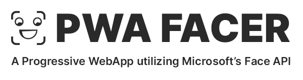

<p align="center">
  
</p>

# PWA Facer
*A Progressive Web App (PWA) utilizing Microsoft’s Face API*

PASTE SCREENSHOT (GIF) HERE

If you want to get a local copy, see [Replicate](#replicate)

# About
This project was part of the class *Knowledge- and Content Management*  during winter term 18/19 in the department of *Natural Language Processing*, held by Prof. Dr. Gerhard Heyer & Dr. Thomas Efer at Leipzig University.

This project consists of two components. (1) A Progressive Web App, which enables the user to take and store photos (of faces to fulfill the purpose), and (2) the capability to analyze faces in regards to various aspects, such as: *Age, Emotions, Gender, Pose, Smile, and Facial Hair*, etc.
## Field of Application 
As of June 2019 the app is being tested at the Max Planck Institute for Cognition and Brain Sciences (CBS) in Leipzig to code facial expressions as they may indicate emotions, such as the seven basic emotions defined by Ekman (i.e., Rage, Anger, Contempt, Disgust, Fear, Joy, Happiness, Sadness and Surprise)[1]. See also Darwin’s *The Expression of the Emotions in Man and Animals*[2]

# Progressive Web Apps
## What is a Progressive Web App?
A Progressive Web App (PWA) is a website that has many features that were previously reserved for native apps, such as: **working offline, push notifications, and device hardware access**. Thus, PWAs combine the flexibility of the web with the experience of a native application. 

Without further ado 

Note the entire code was done in a manuel manner with
https://serviceworke.rs/
https://developers.google.com/web/fundamentals/instant-and-offline/offline-cookbook/

Although there a helper tools, most notably
https://developers.google.com/web/tools/workbox/    

The remainder of the PWA section consists of the *core building blocks* that make a Progressive Web App, which are (1) Responsive Web Design, (2) App Manifest and (3) Service Workers.

## Responsive Web Design (RWD)
The actual App should look and work great across various devices and screen resolutions. As this is the de facto standard for modern web development, no further information is provided here.

Since RWD is not the primary objective of this work I used some mobile-first boiler plate as structural foundation of this. I found a minimal Material Design Lite (MDL) boilerplate at codepen, which I am using:
https://codepen.io/thomaseckhardt/pen/rLWJxr

## Application Manifest
The Application Manifest is a JSON file with different properties. If a website is satisfied by the properties given bei the `manifest.json`, it is possible to pin the app on the home screen, making the app "installable". Taping on this icon will have a native app-feel. Important properties are: `name, short_name, start_url, display, icons`

[see this project’s manifest.json](public/manifest.json)

**Important notes**
- There are some minimal requirements to make the app installable, e.g., check Chrome’s requirements:
  - https://developers.google.com/web/fundamentals/app-install-banners/#criteria

## Service Worker
A Service Worker (SW) is a JavaScript file running in background in its own environment. It is therefore decoupled from the actual website (that means, it runs in its own thread). It allows caching, background sync (once a network connection is established) and push notifications.

**Note** Depending how you set up your Service Worker it will act as a network proxy by interfering all outgoing and incoming traffic. 

**Note** The default SW scope is the folder it is placed in. Thus, it is better to place in the root, rather then in some nested lib/js/ folder. 

### Listenable Events
- fetch
- push notifications
- notification interaction
- background sync
- service worker life cycles

### Life Cycle Methods

#### Register

It is a good practice it set the registration process not within the actual `sw.js` file, rather place it in some container JavaScript file which is included in all Website (e.g., `app.js`). This is making sure, no matter on which site a user will land, that the SW gets registered.

**app.js:**
```
if ('serviceWorker' in navigator) {
  navigator.serviceWorker.register('/service-worker.js')
  .then(function(registration) {
    console.log('Registration successful, scope is:', registration.scope);
  })
  .catch(function(error) {
    console.log('Service worker registration failed, error:', error);
  });
}
```
See [Google Dev](https://developers.google.com/web/ilt/pwa/introduction-to-service-worker#registration_and_scope)

#### Install and Activate

In the install event you can define the resources that should be cached. `caches.open` will open a give cache by name, if not found it will create it
```
self.addEventListener('install', (event) => {
  console.log('SW: Installing', event);
  event.waitUntil(
    caches.open('static-v3')
      .then((cache) => {
        console.log('[sw.js] Precaching App Shell...');
        return cache.addAll([
          '/index.html',
          '/src/js/app.js',
          '/src/js/feed.js',
          '/src/css/app.css',
          '/src/css/feed.css',
          'https://fonts.googleapis.com/icon?family=Material+Icons',
        ]);
      }),
  );
});
```

Activate
```
self.addEventListener('activate', (event) => {
  console.log('SW: Activated', event);
  // return self.clients.claim(); // this is only needed when activation fails...
});
```

### Fetch event
As mentioned earlier, the SW can interfere all network traffic. To see this in all the request a website is doing, you can use:

```
self.addEventListener('fetch', event => {
    console.log('SW: Fetching: ', event);
});
```

For demonstration purpose you can also block every incoming data using `respondWith` set to `null`:

```
self.addEventListener('fetch', (event) => {
  event.respondWith(null);
});
```

Which will lead to a `This site can’t be reached`.

#### Retrieve Items from Cache

To actually retrieve items that are already in the cache

if caches object found return use cache, else normal network
```
self.addEventListener('fetch', (event) => {
  event.respondWith(
    caches.match(event.request).then((response) => {
        // checks if valid response, since response can also be null
        if (response) {
          return response;
        } else {
        return fetch(event.request);
         }
      })
  );
});
```

or a bit shorter:

```
self.addEventListener('fetch', function(event) {
  event.respondWith(
    caches.match(event.request).then(function(response) {
      return response || fetch(event.request);
    })
  );
});
```

#### Dynamic Caching
You can adjust the upper fetch request to also put unknown resources into the Cache API. Thus, you perform dynamic caching in the else block of the fetch listener by chaining another then, such as:

```
self.addEventListener('fetch', (event) => {
  event.respondWith(
    caches.match(event.request)
      .then((response) => {
        if (response) {
          return response;
        }
        // if there is no match in the cache:
        return fetch(event.request)
          .then(res => caches.open('dynamic')
            .then((cache) => {
              cache.put(event.request.url, res.clone());
              return res;
            }))
      }),
  );
});
```

**Note: Difference between `put` and `add`**
`add` takes a URL string, sends a request (key) and automatically stores the response (value) in the cache, as key-value-pair

`put` is not sending any request just stores data you already have, thus the first parameter of put is the `event.request.url`. The second parameter is the response (use `.clone` to create a copy), that you want to return. 

#### Versioning the Service Worker
As of now, if one would change something in the css, html, or js (not in the sw) these changes would not be reflected since the cache version is used. You would manually need to update the sw to trigger re-caching. To solve this one should use versioning. However, it is required to clean-up old cache version, since (a) the website searches all cache elements and might still provide old files and (b) it would otherwise pollute the cache. 

 Activate is a good place for clean-up, since the activation event fires only when a user visits the page again(!), and therefore it is best to check existing caches there. By using `waitUntil` we can clean-up first and make sure not to load an old cache.

 ```
self.addEventListener('activate', (event) => {
  console.log('SW: Activated', event);
  console.log('Cleaning up old static cache...');

  event.waitUntil(
    caches.keys().then(keyList => Promise.all(
      keyList.map((key) => {
        if (key !== "static-v3" && key !== "dynamic") {
          console.log("SW: Removing old Cache", key);
          return caches.delete(key);
        }
        // else
        return null;
      }),
    )),
  );
  // return self.clients.claim(); // this is only needed when activation fails...
});
```

**NOTE** instead of hard-coding the strings use variables:
```
const CACHE_STATIC_NAME = 'static-v4';
const CACHE_DYNAMIC_NAME = 'dynamic-v4';
```

### Caching Strategies
#### App Shell
When thinking about caching, first one need to identify what is the actual app shell. That are things which don’t change often:


from: https://developers.google.com/web/fundamentals/architecture/app-shell

The remainder of this section will give you a brief overview of (almost) all caching strategies using the "recommended" boilerplate code from Google Developers’ site.

#### Cache, falling back to Network
<p align="center">
  
</p>

```
self.addEventListener('fetch', (event) => {
  event.respondWith(
    caches.match(event.request)
    // if caches object found return use cache, else normal network
      .then((response) => {
        if (response) {
          return response;
        }
        return fetch(event.request)
          .then(res => caches.open(CACHE_DYNAMIC_NAME)
            .then((cache) => {
              cache.put(event.request.url, res.clone());
              return res;
            }))
          // If network fails provide offline fallback
          .catch(() => {
            return caches.open(CACHE_STATIC_NAME)
              .then((cache) => {
                return cache.match('/offline.html');
              });
          });
      }),
  );
});
```

Note. The code above also provides the offline.html fallback. If there is no network and no cache match.

#### Cache only
<p align="center">

</p>

```
self.addEventListener('fetch', function(event) {
  // If a match isn't found in the cache, the response
  // will look like a connection error
  event.respondWith(caches.match(event.request));
});
```

#### Network only
<p align="center">
  
</p>

```
self.addEventListener('fetch', function(event) {
  event.respondWith(fetch(event.request));
  // or simply don't call event.respondWith, which
  // will result in default browser behavior
});
```

#### Network falling back to cache
<p align="center">
  
</p>

```
self.addEventListener('fetch', function(event) {
  event.respondWith(
    fetch(event.request).catch(function() {
      return caches.match(event.request);
    })
  );
});
```

#### Cache then network
<p align="center">
  
</p>

YourWebsite.js/.html

```
const url = 'https://website-you-want-to-fetch-data.com/get';
let networkDataReceived = false;

// network request
fetch(url)
  .then(res => res.json())
  .then((data) => {
    networkDataReceived = true;
    console.log('From web: ', data);
    clearCards();
    createCard();
  });

// cache request
caches.match(url).then((response) => {
  if (!response) throw Error('No data');
  return response.json;
}).then((data) => {
  console.log('From cache: ', data);
  if (!networkDataReceived) {
    clearCards();
    createCard();
  }
});
```

sw.js
```
self.addEventListener('fetch', (event) => {
  event.respondWith(
    caches.open(CACHE_DYNAMIC_NAME)
      .then(cache => fetch(event.request).then((response) => {
        cache.put(event.request, response.clone());
        return response;
      })),
  );
});
```

#### Mixing caching strategies, aka routing

It is possible to combine different strategies for a more tailored experience.

This approach fetches the network (if available). If not it will check the cache. To avoid race condition (if both network and cache has the item), the networkDataReceived variable is utilized.

```
const url = 'https://your-fire-base-project.firebaseio.com/posts.json';
let networkDataReceived = false;

// network request
fetch(url)
  .then(res => res.json())
  .then((data) => {
    networkDataReceived = true;
    console.log('From web: ', data);
    updateUI(Object.values(data));
  });

// if network fetch fails use cache:
if ('caches' in window) {
  caches.match(url)
    .then((response) => {
      if (!response.ok) {
        throw Error(response.statusText);
      }
      return response.json();
    })
    .then((data) => {
      console.log('From cache: ', data);
      if (!networkDataReceived) {
        updateUI(Object.values(data));
      }
    });
}
```

## Microsoft Face API
The Face API is a subset of Microsoft’s Cognitive Services

https://azure.microsoft.com/en-us/services/cognitive-services/face/


## Replicate

These instructions will get you a copy of the project up and running on your local machine for development and testing purposes.

### Prerequisites

You only need to have Node.js installed on your machine. Then follow the steps:

### Installing

1. Clone the project and cd into it:

    ```
    git clone https://github.com/Kalaschnik/pwa-facer.git
    ```

2. cd into it
    ```
    cd pwa-facer
    ```
3. install required packages, its only one: http-server
    ```
    npm install
    ```
4. start the project
    ```
    npm start
    ```    
5. Open browser
    ```
    http://localhost:8080
    ```    
## Deployment
Todo

## License

This project is licensed under the MIT License - see the [LICENSE.md](LICENSE.md) file for details

## References
[1]: Ekman, Paul (1999), Basic Emotions, in Dalgleish, T; Power, M (eds.), Handbook of Cognition and Emotion (PDF), Sussex, UK: John Wiley & Sons

[2]: Darwin, C. (1872). The expression of the emotions in man and animals. London, England: John Murray.
http://dx.doi.org/10.1037/10001-000

[here]: https://developers.google.com/web/ilt/pwa/introduction-to-service-worker#registration_and_scope
